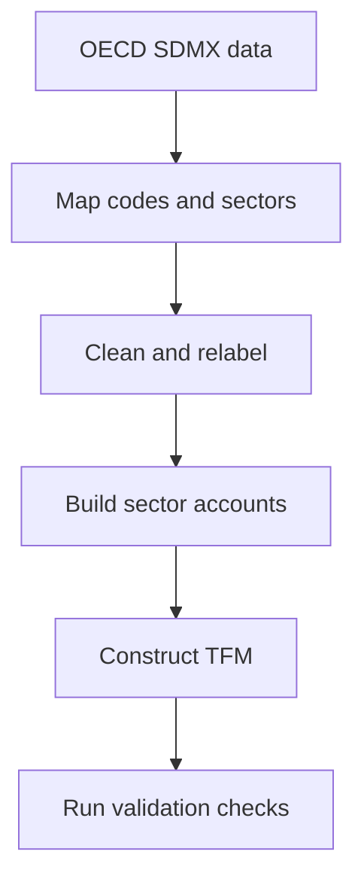
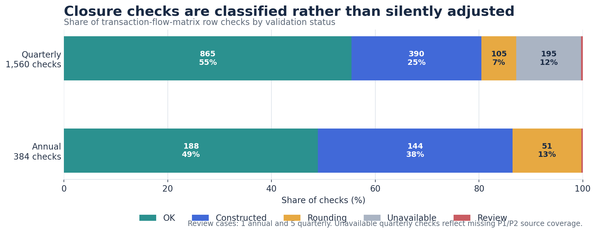
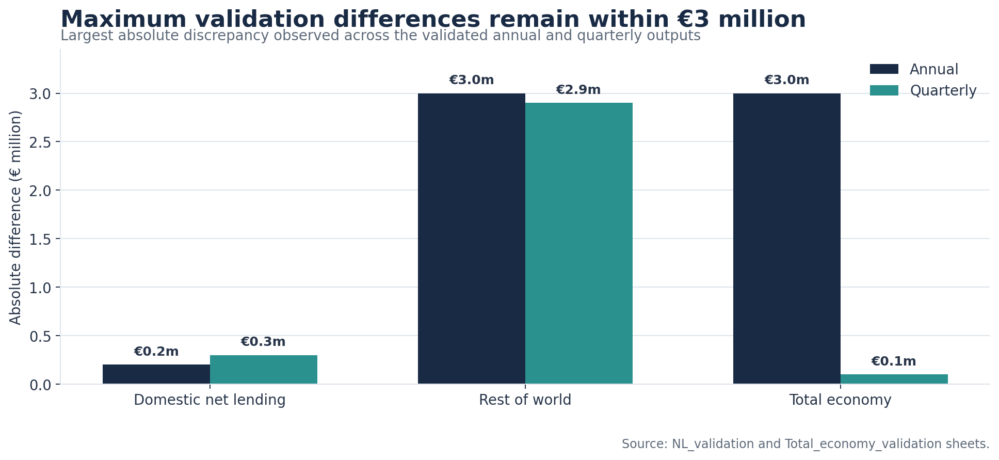
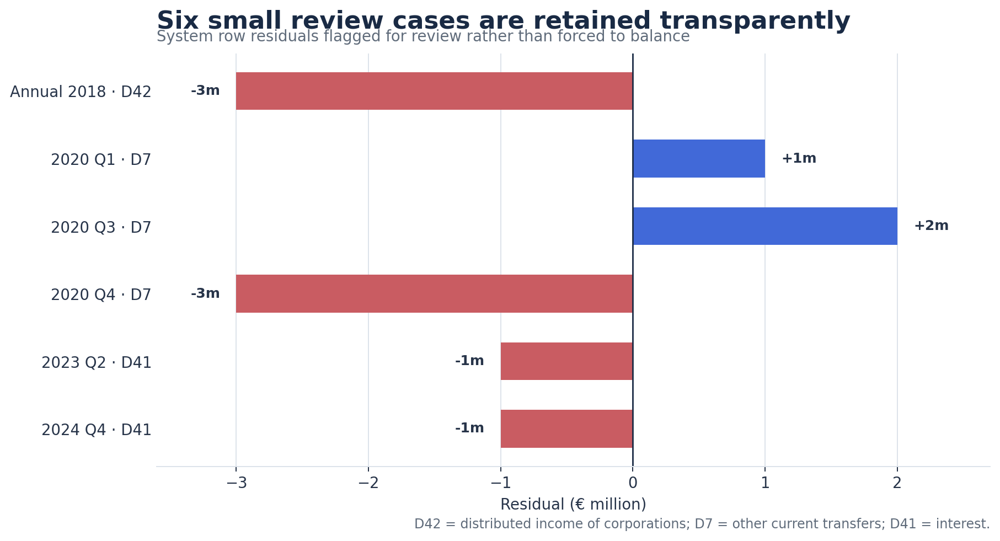

# OECD Data Quality and Validation

An R and Excel pipeline that transforms OECD national-accounts data for Italy into structured sector accounts and validated transaction-flow matrices.

This project was developed through my Economics and Business internship and thesis work. It focuses on the part of data analysis that happens before modelling: understanding source structures, cleaning and relabelling variables, handling incomplete coverage, testing accounting consistency and documenting exceptions.

<p align="center">
  
</p>

**[View the four-page portfolio case study](docs/OECD_Data_Quality_Case_Study.pdf)** · **[Read the detailed validation summary](VALIDATION.md)**

## Project at a glance

| | |
|---|---|
| **Data source** | [OECD Data Explorer](https://data-explorer.oecd.org/) national accounts for Italy |
| **Coverage** | 2010–2025 annually; 2010 Q1–2026 Q1 quarterly |
| **Sectors** | Non-financial corporations, financial corporations, government, households and NPISH, Rest of World, and Total Economy |
| **Tools** | R, RStudio, Excel and OECD SDMX |
| **Main tasks** | Data retrieval, mapping, cleaning, validation, quality assurance and transaction-flow matrix construction |

## Why this project?

Official data are detailed, but not immediately ready for analysis. Annual and quarterly OECD datasets use different structures, long labels and institutional-sector codes. Some expected series are unavailable, and small discrepancies can appear across related accounting views.

The pipeline turns those source files into consistent, reviewable outputs while keeping missing observations, rounding differences and review cases visible.

## Pipeline



## Pipeline components

| Script | Purpose |
|---|---|
| [`01_nonfinancial_annual.R`](R/01_nonfinancial_annual.R) | Retrieves annual OECD data, maps codes, creates sector and Total Economy tables, and produces QA sheets |
| [`02_nonfinancial_quarterly.R`](R/02_nonfinancial_quarterly.R) | Processes non-seasonally-adjusted quarterly data and documents the General Government derivation used when direct S13 observations are unavailable |
| [`03_tfm_annual.R`](R/03_tfm_annual.R) | Builds the annual transaction-flow matrix and tests row closure, net lending and Total Economy consistency |
| [`04_tfm_quarterly.R`](R/04_tfm_quarterly.R) | Builds and validates the quarterly matrix while preserving unavailable production rows and review cases |

## Key results

| Metric | Annual | Quarterly |
|---|---:|---:|
| Periods | 16 | 65 |
| TFM row checks | 384 | 1,560 |
| Maximum domestic net-lending difference | €0.2m | €0.3m |
| Maximum Rest-of-World net-lending difference | €3.0m | €2.9m |
| Maximum Total Economy difference | €3.0m | €0.1m |
| Rows retained for review | 1 | 5 |

No balancing residual or `KADJ` term is inserted to force agreement.

## Validation results

### Row-closure status



### Maximum reconciliation differences



### Review cases retained



## Repository structure

```text
oecd-data-quality-validation/
├── data/          # Controlled glossary, dictionaries and mapping workbook
├── docs/          # Portfolio case study
├── figures/       # Validation charts displayed in this README
├── outputs/       # Final Stage 1 and Stage 2 Excel workbooks
├── R/             # Four annual and quarterly pipeline scripts
├── README.md
├── VALIDATION.md
└── MANIFEST.md
```

## How to run

1. Clone or download this repository.
2. Open R or RStudio and set the working directory to the repository root.
3. Run the relevant Stage 1 script, followed by its Stage 2 script:

```r
# Annual workflow
source("R/01_nonfinancial_annual.R")
source("R/03_tfm_annual.R")

# Quarterly workflow
source("R/02_nonfinancial_quarterly.R")
source("R/04_tfm_quarterly.R")
```

Stage 1 requires an internet connection to retrieve OECD data. New runs may differ from the frozen workbooks because the source data can be revised.

### R packages

`openxlsx`, `dplyr`, `tidyr`, `stringr`, `tibble`, `rsdmx`, `writexl` and `purrr`.

The scripts check for missing packages and install them when required.

## Data-quality decisions

- Quarterly data use the non-seasonally-adjusted (`N`) series consistently.
- When direct quarterly S13 observations are unavailable, General Government values are derived transparently as `S1 - S11 - S12 - S1M` and recorded in dedicated QA sheets.
- Missing quarterly P1/P2 sector observations remain unavailable; they are not replaced with invented zeroes.
- Small rounding differences and review rows remain visible in the output workbooks.
- The separate financial-accounts experiment is excluded because a complete validated financial output and stock-flow reconciliation are outside this case study.

## Limitations

This is a data-processing and accounting-validation project, not a complete macroeconomic model. Results depend on OECD source coverage and can change when official data are revised. The quarterly General Government series includes a documented residual derivation where direct source observations are unavailable.

## Author

**Sahar Shapoori Rad**  
Economics and Business | Data Analytics  
Milan, Italy  
[LinkedIn](https://www.linkedin.com/in/sahar-shapoorirad)
