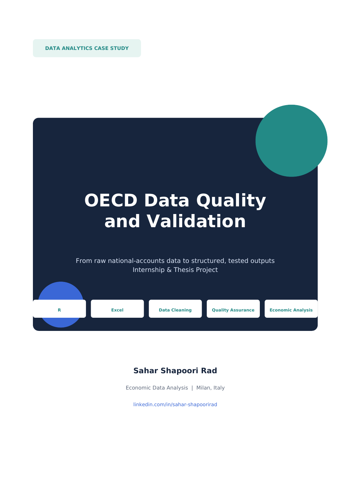
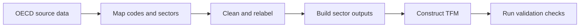

# OECD Data Quality and Validation

This project turns OECD national-accounts data for Italy into structured, reviewable outputs using R and Excel. It was developed through an Economics and Business internship and thesis project focused on data cleaning, classification, validation and stock-flow consistency.

  

**[View the four-page portfolio case study](docs/OECD_Data_Quality_Case_Study.pdf)**  
**[Read the detailed validation summary](VALIDATION.md)**

## Project goal

Official OECD data are detailed, but they are not immediately ready for analysis. Annual and quarterly datasets use long labels, institutional-sector codes and different structures. This project builds a repeatable workflow that:

- maps OECD codes to clear project variables;
- separates annual and quarterly processing;
- creates sector and Total Economy outputs;
- reorganizes the data into transaction-flow matrices;
- tests row closure, net lending and Total Economy consistency;
- records missing values, rounding differences and review cases instead of hiding them.

## Workflow

## Repository contents

| Folder | Contents |
|---|---|
| `R/` | Four final scripts for annual and quarterly Stage 1 and Stage 2 processing |
| `data/` | Controlled input workbook containing the glossary, dictionaries, mapping and Total Economy labels |
| `outputs/` | Final annual and quarterly Stage 1 and TFM workbooks |
| `docs/` | Portfolio case study and cover image |

The scripts run in this order:

1. `R/01_nonfinancial_annual.R`
2. `R/02_nonfinancial_quarterly.R`
3. `R/03_tfm_annual.R`
4. `R/04_tfm_quarterly.R`

## Evidence from the validated outputs

- 16 annual years: 2010–2025
- 65 quarterly periods: 2010 Q1–2026 Q1
- Maximum domestic net-lending error: €0.2 million annually and €0.3 million quarterly
- Explicit QA categories for observed closures, constructed closures, unavailable values, rounding differences and review rows
- Quarterly General Government values are transparently derived from `S1 - S11 - S12 - S1M` when direct S13 observations are unavailable
- No forced balancing adjustment or `KADJ` term

## How to run

1. Clone or download the repository.
2. Open R or RStudio and set the working directory to the repository root.
3. Run the Stage 1 annual or quarterly script. These scripts retrieve OECD data and write their results to `outputs/`.
4. Run the corresponding Stage 2 script to build and validate the transaction-flow matrix.

The scripts install any missing R packages automatically. Stage 1 requires an internet connection to retrieve OECD data. Because OECD data may be revised, a new run can differ from the frozen output workbooks included here.

## Scope

This repository presents the validated non-financial accounts and transaction-flow matrix workflows. A separate financial-accounts module was explored during the wider thesis project, but it is excluded because a complete validated financial output and stock-flow reconciliation are not part of this case study.

## Author

**Sahar Shapoori Rad**  
Economics and Business | Data Analytics  
Milan, Italy  
[LinkedIn](https://www.linkedin.com/in/sahar-shapoorirad)
